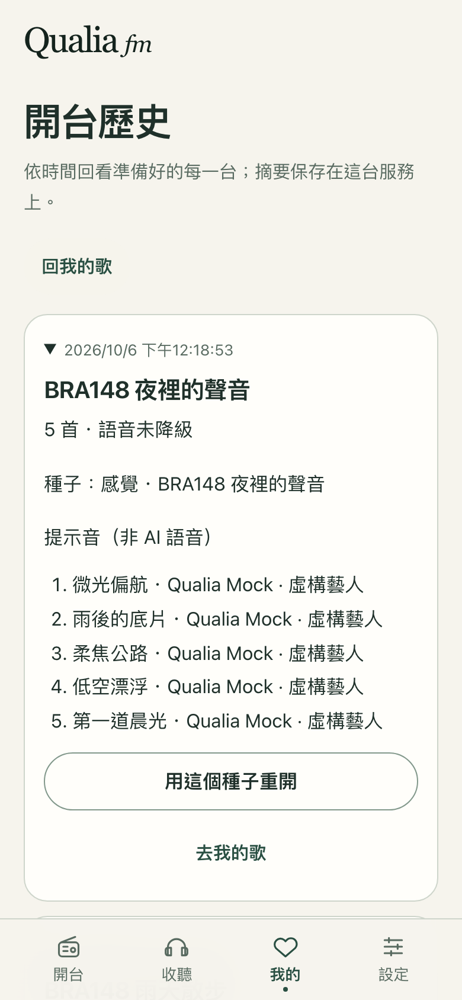
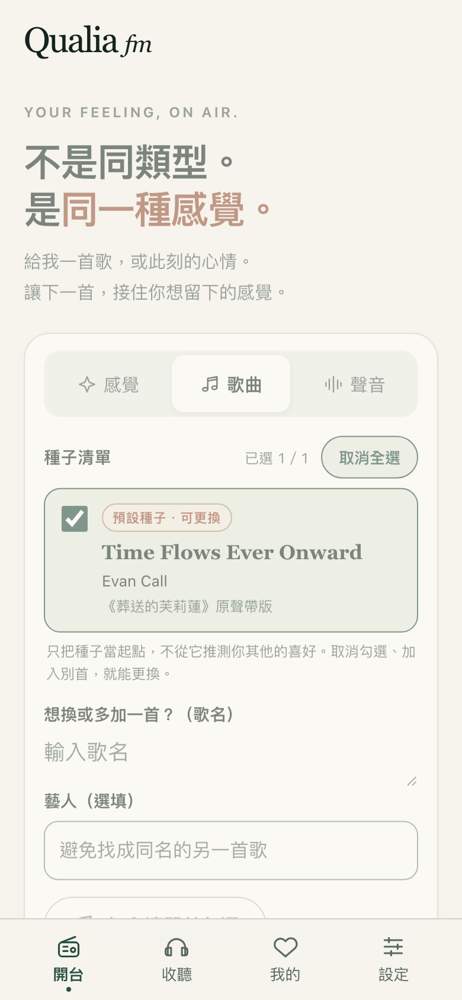

# BRA-148 開台歷史驗收

2026-10-06，Mac mini，Node 25.5.0。審查交付：Sylphy（待審）；未合併、未更新測線或安裝 App。

## 行為與決策

「我的歌」新增次要入口 → 開台歷史 → 展開種子／原始提名曲目／語音狀態 → 去我的歌或用原種子重開。首屏與種子清單沒有修改。摘要沿用品味帳本私有 atomic write，在交付節目前存檔；若不能保存則明示編排失敗，不產生無履歷的成功節目。

D-39／D-40 見 [decision log](decision-log.md)，保存內容、單程序限制與回滾見 [開台歷史](../show-history.md)。不恢復歷史音訊，也不把編排曲目視為聽完紀錄；零首／微調的已交付 plan 也記錄，取消／失敗的 job 不記。

## TDD 證據

公開測試邊界：開台／歷史 HTTP API（包含服務重建）、mobile-390 使用者操作。先寫測試再實作：

- API：兩輪開台成功後，`GET /api/show-history` 原先 `expected 200, got 404`；實作後可讀兩筆，重建 `createApp`、取得新 session 仍回同樣資料。
- UI：點「我的」後原先找不到 `開台歷史` 按鈕（locator timeout）；新增次要入口後完整操作通過。
- DJ 關閉＋供應商不可用：摘要原先 `ttsDegraded: true`，測試預期 `false`；限制為要求 DJ 語音時才標降級後通過。

## V1：兩輪與持久化

[API 測試](../../apps/server/test/showHistory.test.ts) 第一項從 HTTP 開兩輪、等待 completed、冪等重送，斷言清單兩筆／新到舊，服務物件重建後新 session 讀到完全相同的資料，且檔案權限 600。

[E2E](../../e2e/show-history.spec.ts) 第一項開兩輪後從 UI 讀到兩筆、重載瀏覽器後仍有兩筆。讀寫使用真的臨時 JSON 檔，各次 Playwright 啟動隔離在 tmp，不寫 repo data 或測線。

## V2：摘要與重開

API 斷言種子、曲目數／曲名／藝人、提示音、語音降級與 DJ 關閉狀態；假的 TTS 供應商失敗回應測出 `ttsDegraded: true`。損毀不覆寫、缺 session 回 401、注入磁碟寫入失敗後 job failed／showId null 且帶「寫入失敗」訊息；取消／失敗與零首行為亦通過。

mobile-390 展開驗證五首曲目、種子與語音狀態；操作「去我的歌」及「用這個種子重開」，捕捉 POST /api/plan 證明沿用原種子，回到開台進度。第二項 E2E 驗證讀取失敗無假清單、可重試。無橫向溢出與 pageerror。

## V3：首屏維持聚焦

mobile-390 在預設首頁斷言歷史按鈕不存在、四格導覽文字維持「開台／收聽／我的／設定」、種子輸入可見，並保存 390×844 截圖。未修改 HomePage、SeedComposer、ReadyView 或種子清單。

## V4：檢查結果

| 指令 | 結果 |
|---|---|
| `fnm use 25.5.0` | 遵照工單；既有 engines 警告未改 |
| `pnpm lint` | 通過 |
| `pnpm typecheck` | 通過（含 E2E TypeScript） |
| `pnpm test` | 81 檔，832 測試通過 |
| `pnpm build` | contracts／server／web 全通過 |
| `E2E_PORT=4188 pnpm exec playwright test --project=mobile-390` | 66／66 通過（3.3 分鐘，含 session 恢復、我的歌、寶石、播放與假 Spotify 回歸） |
| `E2E_PORT=4188 pnpm exec playwright test e2e/show-history.spec.ts --project=mobile-390` | 最終 build 下 2／2 通過（含新增讀取失敗重試） |
| `git diff --check` | 通過 |

所有供應商測試使用注入假回應，單元測預設封鎖真實網路；E2E 使用隔離 mock 服務，不代表 iPhone／真實 TTS 或 Spotify 串流驗收。沒有改實際 env、Spotify 閘門、usage credits、qualia-real-test、8737 或 launchctl，也沒有停止他人的服務。

## 回滾

revert 本票 commit。沒有 DB migration；新摘要檔可保留，舊版不讀，既有 taste／session 檔案不必變動。
