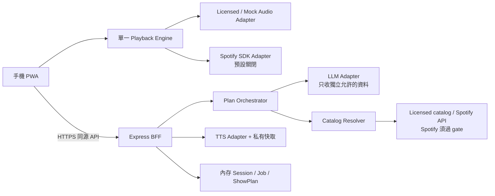

# 04｜工程架構與資料邊界

## 採用技術與範圍

React + Vite + TypeScript，CSS Modules／共用 design tokens，Zustand 管理 UI 與 session；播放器狀態機以獨立 TypeScript 模組實作，不由 UI store 任意更改。Node.js + Express + TypeScript，Zod 驗證 API 與模型回覆。版本由 agent 於開工查官方支援後固定到 lockfile；Node 使用受支援 LTS 並寫入 `.nvmrc`。這是本次工程決策，不代表依賴已安裝或被本包測過。

首版採 `pnpm` workspace：`apps/web`、`apps/server`、`packages/contracts`。無 DB、無 Redis、無常駐排程、無 WebSocket。Job 以 HTTP polling 回報實際 phase；這是相對 Claudio 的明示簡化。內存 session／job 只支援單 backend process，重啟即失效；不能部署成多 instance 卻聲稱能共享狀態。



## 模組與責任

| 模組 | 負責 | 不負責 |
|---|---|---|
| SeedComposer | 使用者輸入、草稿、validation | 直接呼叫模型 |
| PlanService | schema、候選、有限補位、進度、取消 | 播放音訊 |
| EditorialPlanner | Sonic DNA、候選、Bridge、短串詞 | 讀 Spotify API 回傳內容 |
| CatalogResolver | 身分匹配、版本與可用性 | 推論真實音色／歌詞意義 |
| TtsService | 合法文本、hash、合成、快取、上限 | 接受任意長文或供應商 secret |
| PlaybackEngine | 單一 owner、phase、音訊、queue、恢復 | 發起無限生成或自行改 gate |
| ProviderAdapter | 標準播放事件／capabilities | 假裝別家服務有相同能力 |
| SessionStore | token／job owner／到期 | 多使用者產品資料庫 |

## 預期目錄（工程實作時建立）

```text
qualia-fm/
  apps/web/src/
    app/                 # router、AppShell、providers
    features/seed/       # compose、generation、validation
    features/player/     # page、controls、bridge、queue、tune
    features/settings/
    audio/               # engine、events、state、adapters
    api/                 # typed client、job polling、abort
    styles/              # tokens、global、a11y
  apps/server/src/
    routes/              # session、capabilities、plan、jobs、shows、tts、auth
    services/            # planner、resolver、tts、budget、privacy guard
    providers/           # llm、tts、catalog adapters
    stores/              # in-memory repositories
    security/            # csrf、session、redaction、origin、rate limits
  packages/contracts/    # schema、domain、error codes
  prompts/
  tests/                 # unit、contract、integration、e2e
  data/tts/              # gitignored；帶 owner namespace、TTL
  .env.example
  pnpm-workspace.yaml
```

## 四種運作模式

| mode | 真實聲音 | 真實曲目 | 用途 |
|---|---|---|---|
| mock | 無，或明示測試音 | 否／固定 fixture | UI／狀態測試；不能充當正式完成 |
| licensed | 有，來源須核對 | 是 | 完整 Segment／DJ 播放閉環 |
| spotify | Spotify SDK | 是 | 僅在政策與帳號能力通過時啟用 |
| external | 外部 App 播放，本站不知道進度 | 可為已驗證外連 | 清單與 Bridge 降級，不假裝串流 |

每個 adapter 回報 `canPlay`、`canSeek`、`canProgrammaticallySetVolume`、`canInsertSpeech`、`canOverlap`、`supportsBackground`，其中 background 為 `unknown | tested-limited | unsupported`，不是預設 true。前端依能力顯示，不靠 provider 名稱硬猜。

## 模型資料防火牆

`EditorialInput` 與 `ResolvedTrack` 使用不同型別與 import 邊界。LLM 只可接收：使用者自行輸入的感覺／歌名／藝人／描述、原始模型候選、具備 AI 使用權的獨立編輯資料。不能序列化整個 ShowPlan、Session 或 Spotify response 作為 prompt。

Spotify API 回傳只在 resolver／UI 來源標示／播放授權路徑使用。禁止將音訊、audio features、歌詞、artwork、收藏、歷史、個人資料、resolver search results 傳給 LLM 或 TTS。TTS 讀取的是模型在 resolution 之前產生的、經核對可使用的 DJ 文本；不得把 Spotify 新回傳欄位補進台詞。[R1/R2]

若獨立資料來源不能支持某個音色／編曲判斷，應表達不確定，而不是偷偷抓 Spotify 做音訊分析。透過 typed DTO allowlist 與 spy test 驗證 outbound payload；不能只靠 prompt 要模型守規則。

## Server ShowPlan 與 Client ShowSession

Server 的 ShowPlan 是不可變的編排成果。Client 的 ShowSession 管理實際 queue、目前 Segment、`queueRevision` 與播放進度。首版單使用者、單活躍播放頁籤；不以 server timer 控手機音訊。

移除／復原／微調尾段是本機 queue transaction，成功後增加 revision。新 plan 生成時捕捉 target sessionId/revision；完成時如果已換台、換 provider 或 revision 不符，要求重新套用或丟棄，不覆蓋當前 session。TTS cache 以文字與聲線命中，不以會變的 queue index 命中。

## PWA／手機存取

桌機 dev：Vite proxy `/api` 到 Express。手機需可連到同一服務的可信 HTTPS 網域；同源路由包含 `/api/auth/spotify/callback`。不把 `http://192.168.x.x` 當成已符合 Spotify redirect／secure context。

可選部署拓樸：電腦上的單一 server＋受保護 HTTPS reverse proxy／私有存取；正式上線前則單 instance HTTPS Node host。此包不建立 tunnel、domain 或雲端資源。若 server 在電腦上，電腦需運作且手機連得到；PWA 不會把 server 搬進手機。[R7/R15]

Service Worker 只預快取靜態 app shell，不快取 `/api/auth/*`、tokens、Spotify 串流、任意第三方曲目與帶私密內容的 API。離線可開 shell ≠ 離線音樂。新版更新提示「有新版本，停止播放後更新」，不可自動 reload 打斷播放。

Media Session 用於支援的鎖屏 metadata／控制，不等於保證背景執行或完整 DJ 接續。Spotify adapter 讓 SDK 的 Media Session 管理自己；licensed adapter 才由自有 engine 管理，避免兩組 handlers 互相覆寫。[R3/R14]
