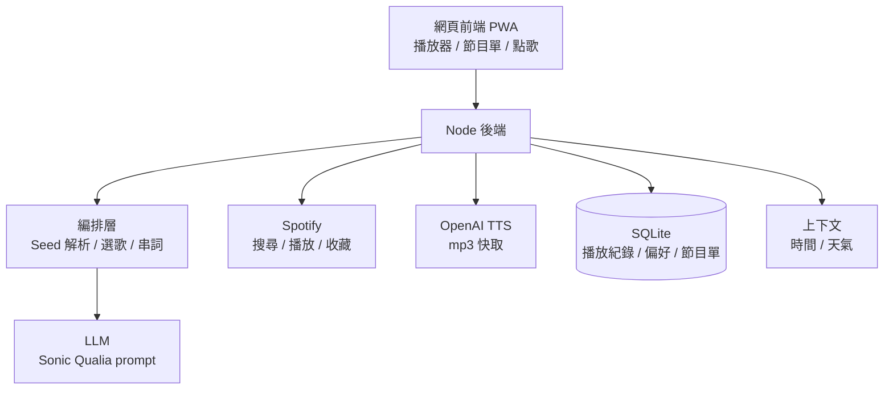

# Qualia FM 完整版計劃

**產品定位**：一個依「聲音質地」而不是類型或人氣來選歌的個人 AI 電台。DJ 會用語音解釋每首歌為什麼接在上一首後面，這個「為什麼」就是產品的核心。

## 1. 產品願景

- 不是推薦演算法，也不是播放器，而是會編排整段聲音流的電台主持人。
- 賣點是 Bridge（為什麼這首接那首）：跨類型、靠質地與情緒配對，並且講得出來。
- 使用場景：深夜工作、練舞暖身、開車、放空。

## 2. 核心概念

- **Seed**：使用者給的起點，可以是一首歌、一種感覺或一段聲音描述。
- **Sonic DNA**：空間感、情緒速度、音色、歌詞情境。
- **Bridge**：兩首歌之間的連結理由，同時是 DJ 串詞的素材。
- **Segment（節目段）**：一段由「串詞加歌曲」組成的播放單位。
- **Show（節目單）**：由多個 Segment 排成的一整段節目。

## 3. 分階段路線

### 階段 0：MVP（下午 5 小時）
輸入 Seed，得到 5 首歌、串詞語音、Spotify 播放。細節見 QUALIA_FM_MVP.md。

### 階段 1：可日常使用（約 1 週）
- 無限接續：快播完時自動依最近播放再生成下一批
- 記憶：存聽過、跳過、按讚的歌，下次餵回 prompt
- 使用者點歌隊列，與節目單隊列分開
- 串詞預先生成與快取，減少等待
- 存下節目單，可回放與分享
- 部署成可從手機開的網頁

### 階段 2：個人化電台（約 2 至 4 週）
- 口味檔案（taste profile）：從 Spotify 收藏與長期播放紀錄建立，供 LLM 參考
- 時段與情境模式：早晨、通勤、深夜、練舞
- 舞蹈模式：輸入練習目標，依 BPM 與強度排出暖身到爆發的曲單
- 聲音人設：可選擇 DJ 的語氣與聲線
- 加入天氣、時間等簡單上下文，當串詞素材

### 階段 3：產品化（約 1 至 2 個月）
- 多使用者與帳號
- 分享節目頁，別人可以直接聽你的某一集
- 費用控管：快取、串詞長度上限、用量限制
- 授權與合規：確認 Spotify 開發者條款是否允許公開上線
- 收費假設驗證：訂閱制、舞蹈教室或咖啡店的情境版

## 4. 系統架構（完整版）

分層說明：
1. **互動層**：前端與 HTTP/WebSocket，負責播放、顯示、點歌。
2. **編排層**：決定下一批歌、串詞、節目節奏。
3. **能力層**：LLM、Spotify、TTS、上下文。
4. **記憶層**：SQLite 存紀錄與偏好。

## 5. 資料模型（階段 1 起）

- `plays`：曲目 ID、播放時間、是否被跳過、是否按讚
- `shows`：節目單 ID、Seed、建立時間
- `segments`：所屬節目單、順序、曲目、串詞文字、mp3 路徑
- `preferences`：偏好標籤與權重
- `settings`：DJ 人設、語言、音量壓低比例

## 6. 關鍵設計決策

| 問題 | 建議 | 原因 |
|---|---|---|
| 選歌靠 LLM 還是 Spotify 推薦 | 靠 LLM，Spotify 只做搜尋與播放 | 推薦端點對新 app 可能受限，且這份 prompt 的價值就是不靠人氣 |
| 串詞與選歌分兩次還是一次生成 | 一次生成，輸出 JSON 同時含 bridge 與 DJ 台詞 | 少一次呼叫，延遲與成本都降低 |
| TTS 何時生成 | 播放上一首時就預先生成下一段 | 避免歌與歌之間出現空白 |
| 找不到歌怎麼辦 | 多要 2 首候補，搜不到就丟掉補位 | LLM 會編出不存在的歌 |
| 要不要資料庫 | 階段 0 不要，階段 1 才用 SQLite | 先把核心體驗做出來 |

## 7. 風險清單

| 風險 | 影響 | 對策 |
|---|---|---|
| Spotify 無 Premium 或條款限制 | 無法播完整歌曲或不能公開上線 | MVP 先自用，階段 3 前先讀條款 |
| LLM 幻覺歌名 | 找不到歌、節目中斷 | 搜尋驗證加候補 |
| TTS 成本與延遲 | 費用上升、體驗卡頓 | 快取、預先生成、串詞長度上限 |
| 串詞聽久變制式 | 新鮮感下降 | 變換語氣模板，餵入上下文與記憶 |
| 金鑰外洩 | 被盜用 | 只放後端 `.env`，不進版本庫與對話 |
| 範圍膨脹 | MVP 做不完 | 嚴守「一定要有」清單 |

## 8. 成功指標

- MVP：90 秒內完成一次完整 demo，5 首歌至少 4 首可播。
- 階段 1：自己連續使用一週，主動回來聽的次數。
- 階段 2：跳過率下降，按讚率上升。
- 階段 3：有人願意付費或願意分享給朋友。

## 9. 待決定

- 是否要公開上線，或只當個人作品？
- 舞蹈模式是否作為主打差異？
- 串詞語氣要偏專業電台、朋友聊天，還是舞者口吻？

## 附錄：Sonic Qualia Architect prompt 重點

角色是以「質地（Qualia）、情緒共鳴、氛圍密度」配對歌曲，而非 metadata 或人氣。分析四個面向：空間特徵、情緒速度、音色、歌詞情境。流程：深度拆解 Seed 的「感覺鉤子」、跨類型找「聲音雙胞胎」、輸出 3 至 5 首並附 Bridging Insight。完整原文請貼入 `prompts/sonic-qualia.md`。

## 請 GPT 優化時可以請它檢查

階段拆法是否合理、關鍵設計決策有沒有更好的選項、Spotify 條款對階段 3 的影響。
